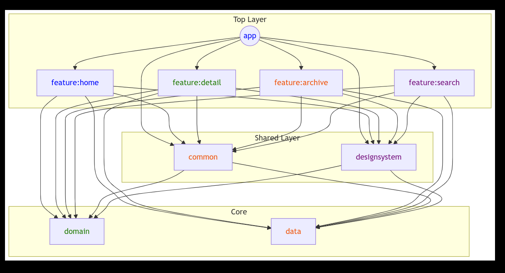

## Project Overview

This Android application is a comprehensive news aggregation app that fetches and displays top headlines from various sources in the United States, focusing on technology companies like Microsoft, Apple, Google, and Tesla.

## Key Features

- **Dynamic News Aggregation**: Fetches real-time top headlines using NewsAPI
- **Multi-Company Coverage**: Includes headlines from Microsoft, Apple, Google, and Tesla
- **Offline Caching**: Implemented caching for offline access to previously loaded news
- **Modern UI**: Developed using Jetpack Compose with Material Design principles
- **Multi-Module Architecture**: Modular app structure for improved maintainability
- **Clean Architecture with MVI Pattern**: Providing a layered, decoupled approach to app design
- **Dark/Light theme**: Support changing theme without the need to restart the app

### Architecture Layers

#### Modules
- **app**: Main application module, orchestrates app-level dependencies and configurations
- **common**: Shared utilities, extensions, and common components used across modules
- **designsystem**: Centralized design resources, custom UI components, and theme definitions
- **data**: Implements data sources and repositories
- **domain**: Use cases and domain models
- **feature:home**: Home screen implementation with top headlines list
- **feature:detail**: Detailed article view and interactions
- **feature:archive**: Offline news storage and archived articles management
- **feature:search**: Search functionality and related UI components

#### Releases
Link to release apk file: [https://github.com/mastani/Android-News-App-Challenge/releases/download/v1/app-production-site-release.apk](https://github.com/mastani/Android-News-App-Challenge/releases/tag/v1)
